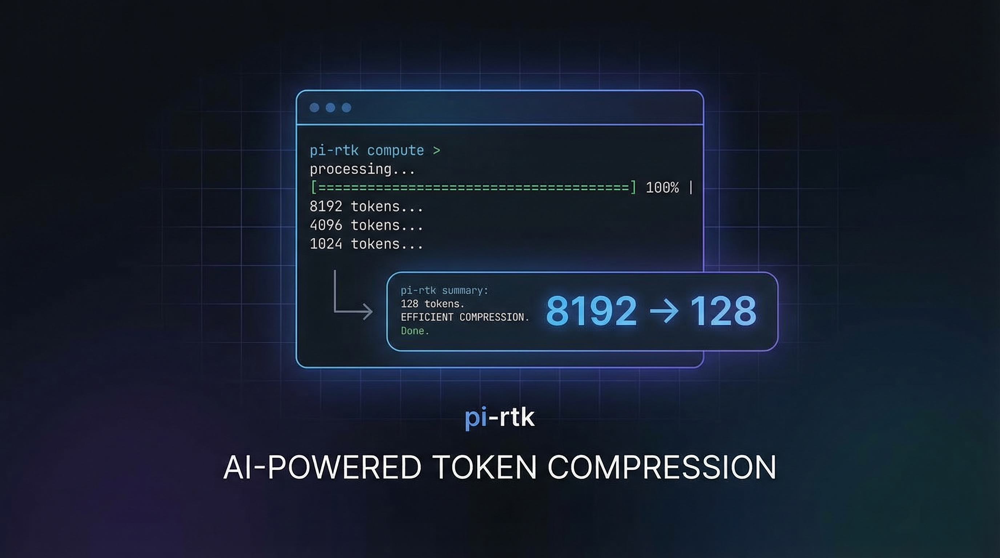

<p align="center">
  
</p>

<h1 align="center">pi-rtk</h1>
<p align="center"><strong>Token Killer for <a href="https://github.com/badlogic/pi-mono">Pi</a> -- cut LLM token consumption by 60-90% on common dev commands</strong></p>
<p align="center">
  <!-- BADGES:START -->
  <a href="https://www.npmjs.com/package/pi-rtk"></a>
  <a href="https://www.npmjs.com/package/pi-rtk"></a>
  <a href="https://github.com/codexstar69/pi-rtk/actions/workflows/ci.yml"></a>
  <a href="LICENSE"></a>
  <a href="https://www.typescriptlang.org/"></a>
  <a href="https://github.com/codexstar69/pi-rtk/pulls"></a>
  <!-- BADGES:END -->
</p>
<p align="center">
  <a href="#install">Install</a> ·
  <a href="#quick-start">Quick Start</a> ·
  <a href="#how-it-works">How It Works</a> ·
  <a href="#features">Features</a> ·
  <a href="#filter-reference">Filters</a> ·
  <a href="#contributing">Contributing</a>
</p>

---

A Pi extension that intercepts tool output and strips noise before the LLM sees it. Pure TypeScript, no binary dependency. Uses Pi's `tool_call`/`tool_result` hooks to filter output in-process.

## Install

```bash
pi install npm:pi-rtk
```

That's it. RTK activates automatically on your next session.

## Quick Start

Once installed, pi-rtk works transparently. When the LLM runs `git status` and gets back 2,400 tokens of output, pi-rtk compresses it to ~320 tokens:

```
# Before (raw git status -- 2,400 tokens)
On branch main
Your branch is up to date with 'origin/main'.

Changes to be committed:
  (use "git restore --staged <file>..." to unstage)
        modified:   src/foo.ts
        modified:   src/bar.ts
        new file:   src/baz.ts
...

# After (pi-rtk filters it -- 320 tokens)
📌 main (up to date)
✅ Staged: 3 files
   src/foo.ts  src/bar.ts  src/baz.ts
❓ Untracked: 1 files
   new-file.txt
```

The LLM gets all the information it needs with 87% fewer tokens.

## How It Works

pi-rtk hooks into Pi's extension API at two points:

1. **`tool_call`** -- Stores the command being executed (e.g., `git diff`, `bun test`) by `toolCallId`.
2. **`tool_result`** -- Receives the raw output, matches it against 22 filter modules, applies the matching filter, tracks savings in SQLite, and returns the compressed output.

```
LLM requests "git diff"
  → Pi fires tool_call → RTK stores command
  → Bash executes git diff → 8,000 tokens of output
  → Pi fires tool_result → RTK matches git-diff filter
  → Filter compresses to ~1,600 tokens (80% reduction)
  → LLM sees compact diff with stat summary + key hunks
  → SQLite records: 8000 raw → 1600 filtered
  → Status footer updates: "rtk ~6Kt"
```

Safety: if any filter throws, RTK passes through the raw output unchanged. The LLM never loses information.

### Tee Recovery

When a command fails (non-zero exit), RTK saves the raw unfiltered output to `~/.pi/agent/rtk/tee/` and appends a hint:

```
[full output: ~/.pi/agent/rtk/tee/2026-03-17_001234_git-diff.txt]
```

The agent can `read` this file if the filter was too aggressive.

## Features

- **22 filter modules** covering git, directory listings, test runners, linters, grep, JSON, Docker, package managers, HTTP, file reads, and log dedup
- **Post-execution filtering** -- works on actual output, not predicted format
- **Read tool filtering** -- strips comments from source files, extracts JSON schemas
- **SQLite analytics** -- tracks every filtered command with raw/filtered token counts
- **Tee recovery** -- saves raw output on failures so the agent can recover
- **TUI settings panel** -- toggle filters, configure tee, per-project or global
- **Status footer** -- shows cumulative session savings in the Pi status bar
- **Zero config** -- works out of the box with sensible defaults
- **Config layers** -- env vars > settings.json > defaults

## Filter Reference

| Filter | Commands | What It Does | Typical Savings |
|--------|----------|-------------|-----------------|
| `git-status` | `git status` | Emoji-grouped compact output with branch tracking | 87% |
| `git-diff` | `git diff` | Stat summary + compact hunks with file:line headers | 80% |
| `git-log` | `git log` | Oneline format, max 20 commits, 80-char truncation | 92% |
| `git-action` | `git push/pull/fetch/add/commit` | Single "ok" summary line | 95% |
| `git-branch` | `git branch` | Compact branch list with current marker | 75% |
| `ls` | `ls`, `find`, `fd`, `tree`, `eza` | Directory grouping, noise hiding, extension summary | 80% |
| `test-js` | `bun test`, `vitest`, `jest`, `npm test` | Pass/fail summary, failing test names + first error line | 95% |
| `test-py` | `pytest`, `python -m pytest` | Pass/fail summary with failure details | 90% |
| `test-rs` | `cargo test` | Pass/fail summary | 85% |
| `test-go` | `go test` | Pass/fail summary | 85% |
| `lint-tsc` | `tsc`, `bunx tsc` | Errors grouped by TS code, 5 per group cap | 87% |
| `lint-js` | `eslint`, `biome` | Errors grouped by rule, suggestion stripping | 70% |
| `lint-py` | `ruff` | Errors grouped by rule code | 75% |
| `lint-rs` | `cargo clippy`, `cargo build` | Warnings grouped by lint name | 80% |
| `grep` | `rg`, `grep` | File grouping, match capping, dedup, summary | 84% |
| `json-schema` | JSON file reads | Type replacement, array/object collapse, max depth 3 | 93% |
| `docker-list` | `docker ps`, `docker images` | Compact table with short IDs | 80% |
| `docker-logs` | `docker logs` | Log dedup with line collapsing | 90% |
| `npm-install` | `bun/npm/pnpm/yarn install` | Single summary line, preserves vulnerability warnings | 90% |
| `pip-install` | `pip install` | Single summary line | 90% |
| `read-filter` | File reads via `read` tool | Comment stripping per language, preserves doc comments | 60% |
| `log-dedup` | Any output with repeated lines | Consecutive line collapsing with (xN) suffix | 70% |
| `http` | `curl`, `wget`, `xh` | Status code + response summary | 80% |

## Commands

### `/rtk gain [period]`

Shows a token savings dashboard with per-filter breakdown, bar charts, and totals.

```
RTK Token Savings -- All time

Command          Runs  Raw      Filtered  Saved
──────────────────────────────────────────────────
git diff           12  45.2K    8.1K      82%  ████████░░
git status         28   8.4K    2.1K      75%  ███████░░░
bun test            6  32.0K    3.2K      90%  █████████░
──────────────────────────────────────────────────
Total              46  85.6K   13.4K      84%

Session: ~72K tokens saved
```

Periods: `24h`, `7d`, `30d`, `all` (default).

### `/rtk discover`

Finds commands that ran without filtering and estimates how much they could save:

```
RTK Discover -- Missed Optimization Opportunities

These commands ran without filtering and could save tokens:

  cargo build (ran 4x, ~12K tokens each) -> lint-rs filter would save ~80%
  docker compose up (ran 2x, ~8K tokens) -> docker-compose filter would save ~90%

Estimated additional savings: ~52K tokens/session
```

### `/rtk settings`

Opens a TUI overlay panel where you can toggle individual filter groups, configure tee recovery, and switch between project and global scope.

## Configuration

pi-rtk stores settings in Pi's `settings.json` under the `rtk` key. Project settings override global settings, and environment variables override both.

### Settings file

Global: `~/.pi/agent/settings.json`
Project: `.pi/settings.json`

```json
{
  "rtk": {
    "enabled": true,
    "filters": {
      "git": true,
      "ls": true,
      "test": true,
      "lint": true,
      "grep": true,
      "json": true,
      "docker": true,
      "npm": true,
      "read": true,
      "logDedup": true,
      "http": true
    },
    "tee": {
      "enabled": true,
      "mode": "failures",
      "maxFiles": 20,
      "maxFileSize": 1048576
    },
    "minOutputChars": 100,
    "excludeCommands": [],
    "debugMode": false
  }
}
```

### Environment variables

| Variable | Description |
|----------|-------------|
| `RTK_ENABLED` | `0`/`1` -- master kill switch |
| `RTK_FILTER_GIT` | `0`/`1` -- toggle git filter group |
| `RTK_FILTER_LS` | `0`/`1` -- toggle ls filter group |
| `RTK_FILTER_TEST` | `0`/`1` -- toggle test filter group |
| `RTK_FILTER_LINT` | `0`/`1` -- toggle lint filter group |
| `RTK_FILTER_GREP` | `0`/`1` -- toggle grep filter group |
| `RTK_FILTER_JSON` | `0`/`1` -- toggle json filter group |
| `RTK_FILTER_DOCKER` | `0`/`1` -- toggle docker filter group |
| `RTK_FILTER_NPM` | `0`/`1` -- toggle npm filter group |
| `RTK_FILTER_READ` | `0`/`1` -- toggle read filter group |
| `RTK_FILTER_LOG_DEDUP` | `0`/`1` -- toggle log dedup filter group |
| `RTK_FILTER_HTTP` | `0`/`1` -- toggle http filter group |
| `RTK_TEE_ENABLED` | `0`/`1` -- toggle tee recovery |
| `RTK_TEE_MAX_FILES` | Max tee files to keep (default: 20) |
| `RTK_TEE_MAX_FILE_SIZE` | Max file size in bytes (default: 1048576) |
| `RTK_MIN_OUTPUT_CHARS` | Min output length to filter (default: 100) |
| `RTK_DEBUG` | `0`/`1` -- enable debug notifications |

### `excludeCommands`

Array of substring patterns. Commands matching any pattern skip filtering:

```json
{
  "rtk": {
    "excludeCommands": ["my-special-script", "cat /etc/"]
  }
}
```

## Interaction with pi-lcm

pi-rtk and [pi-lcm](https://github.com/codexstar69/pi-lcm) are complementary:

- **pi-rtk** reduces the *size* of each message entering the context (fewer tokens per tool result)
- **pi-lcm** manages what happens when the context window fills up (hierarchical DAG summarization)

Together, a session that would normally burn through 200K tokens and lose everything after compaction instead uses ~40K tokens (pi-rtk) and preserves everything via searchable DAG (pi-lcm).

Install both:

```bash
pi install npm:pi-lcm npm:pi-rtk
```

## Architecture

```
pi-rtk/
├── index.ts                    # Extension entry point, event wiring
├── src/
│   ├── pipeline.ts             # tool_call/tool_result handler logic
│   ├── matcher.ts              # Command pattern matching
│   ├── config.ts               # Config resolution (env > settings > defaults)
│   ├── settings.ts             # Load/save from Pi's settings.json
│   ├── settings-panel.ts       # TUI overlay for /rtk settings
│   ├── tracker.ts              # SQLite analytics (record/query savings)
│   ├── tee.ts                  # Raw output recovery on failure
│   ├── gain.ts                 # /rtk gain dashboard formatting
│   ├── discover.ts             # /rtk discover opportunity analysis
│   ├── utils.ts                # ANSI stripping, token estimation, helpers
│   ├── db/
│   │   ├── connection.ts       # SQLite connection management
│   │   └── schema.ts           # Table migrations
│   └── filters/
│       ├── index.ts            # Filter registry (22 filters, first-match)
│       ├── git-status.ts       # git status -> compact emoji format
│       ├── git-diff.ts         # git diff -> stat + compact hunks
│       ├── git-log.ts          # git log -> oneline, max 20
│       ├── git-action.ts       # push/pull/fetch/add/commit -> "ok" line
│       ├── git-branch.ts       # branch list -> compact
│       ├── ls.ts               # ls/find/fd/tree -> grouped
│       ├── test-js.ts          # bun/vitest/jest -> pass/fail summary
│       ├── test-py.ts          # pytest -> pass/fail summary
│       ├── test-rs.ts          # cargo test -> pass/fail summary
│       ├── test-go.ts          # go test -> pass/fail summary
│       ├── lint-tsc.ts         # tsc -> grouped by error code
│       ├── lint-js.ts          # eslint/biome -> grouped by rule
│       ├── lint-py.ts          # ruff -> grouped by rule
│       ├── lint-rs.ts          # clippy/build -> grouped
│       ├── grep.ts             # rg/grep -> grouped by file
│       ├── json-schema.ts      # JSON -> schema extraction
│       ├── docker.ts           # docker ps/images/logs
│       ├── npm-install.ts      # package install -> summary
│       ├── read-filter.ts      # Comment stripping for file reads
│       ├── log-dedup.ts        # Repeated line collapsing
│       └── http.ts             # curl/wget -> status + summary
└── test/                       # 24 test files, 754 tests
```

## Contributing

See [CONTRIBUTING.md](CONTRIBUTING.md) for development setup, test commands, and PR guidelines.

## License

[MIT](LICENSE)
